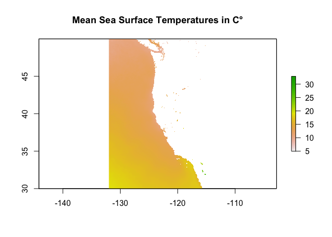
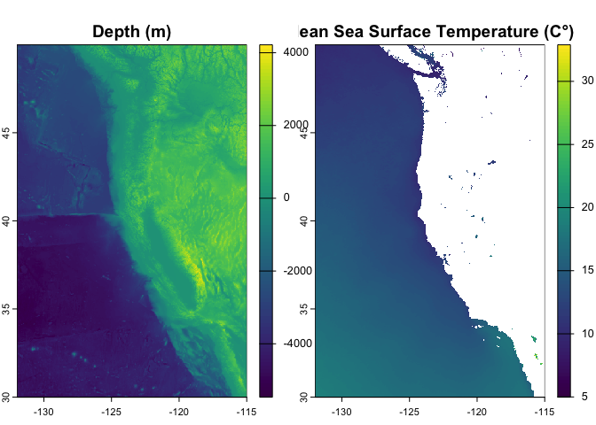
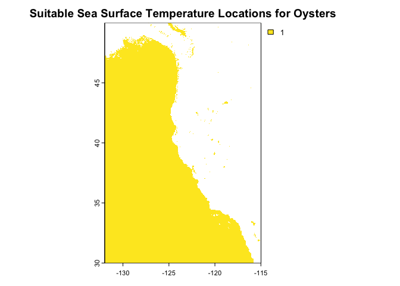
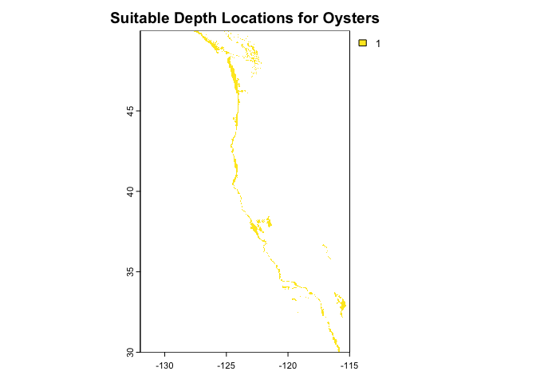
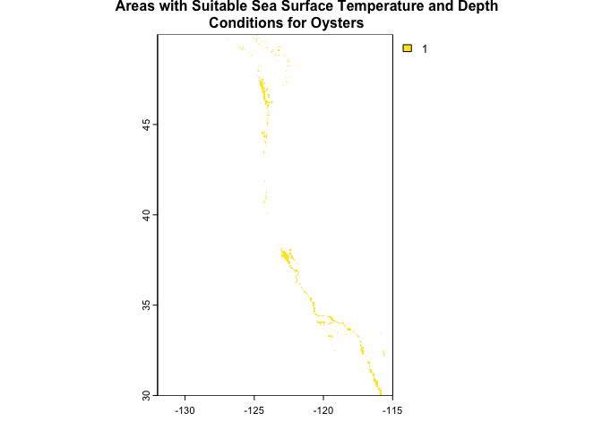
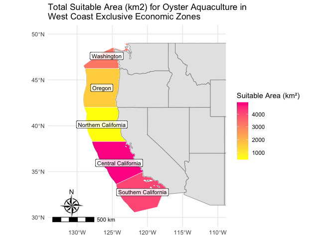
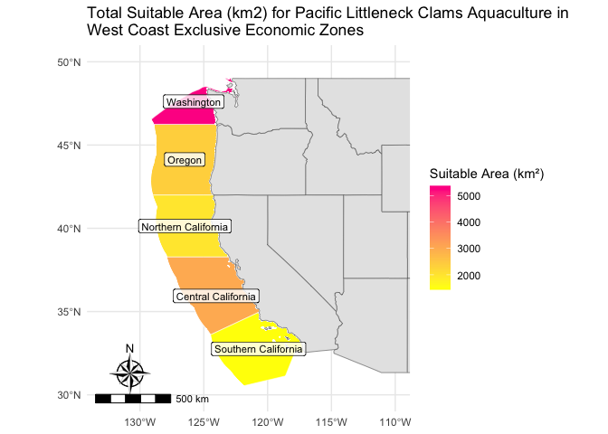
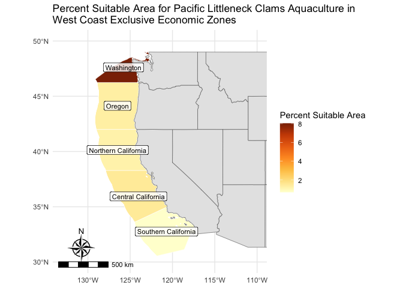

Marine Aquaculture Suitability
================
Emma Cardoso
2023-12-13

## Background

According to the [National Oceanic and Atmospheric
Administration](https://www.fisheries.noaa.gov/insight/marine-aquaculture#:~:text=Marine%20aquaculture%20provides%20a%20domestic,supports%20our%20wild%20fisheries%20production.)
within the United States Department of Commerce, marine aquaculture
refer to the “breeding, rearing, and harvesting of aquatic plants and
animals”.[^1] While seafood is recognized as a source of protein for
over 3 billion people globally, the United States imports over 60% of
consumed seafood, resulting in a deficit exceeding \$16 billion. [^2].
Thus, as marine aquaculture has the ability to boost food production,
create economic opportunities and boost local economies, and can help
keep waterways clean, the implementation of additional marine
aquacultures in the United States should be seriously considered. Within
the United States, marine aquacultures primarily produce oysters,
mussels, shrimp, clams, salmon, and other marine fish that can survive
in the oceanic conditions off the US’ coast.[^3]

Economic Exclusion Zones, EEZ, are regions of the ocean in which coastal
nations have jurisdiction over living and non-living resources.[^4]
These zones typically extend approximately 200 nautical miles (230
miles) beyond a coastal nation’s territorial sea.[^5]

The purpose of this analysis is to identify which Economic Exclusive
Zones off the West Coast of the United States are best suited for
developing Marine Aquacultures for several species of oysters, as
oysters are organisms that have proved successful for United States
aquacultures. Additionally, this project aims not only to assess which
EEZs are suitable for oysters, but also to create a function in which
the optimal conditions for survival (sea surface temperatures and depth
below sea level) can be inputted for any aquatic species, and the
generated output will indicate which West Coast EEZs are best suited for
developing marine aquacultures for said species.

In regards to oysters, based on previous research, it is known that
oysters need the following conditions for optimal growth :  

- sea surface temperature: 11-30°C  
- depth: 0-70 meters below sea level

Credit : This analysis is based upon materials developed by Ruth Oliver,
a professor within UC Santa Barbara’s Bren Graduate School of
Environmental Data Science.

### Data

#### Sea Surface Temperatures

Using data originally generated from [NOAA’s 5km Daily Global Satellite
Sea Surface Temperature Anomaly
v3.1](https://coralreefwatch.noaa.gov/product/5km/index_5km_ssta.php),
this analysis will use the average annual sea surface temperatures (SST)
from 2008-2012 to characterize the average sea surface temperatures
within the area.

#### Bathymetry

For data regarding the depth of the ocean, data from [General
Bathymetric Chart of the Oceans
(GEBCO)](https://www.gebco.net/data_and_products/gridded_bathymetry_data/#area)
will be utilized.

#### Economic Exclusive Zones

Maritime boundaries will be designated using Economic Exclusive Zones
(EEZ) off the West Coast of the United States, where this data was
collected from
[Marineregions.org](https://www.marineregions.org/eez.php).

## Data Analysis Workflow

``` r
#loading in libraries
library(here)
library(sf)
library(terra)
library(dplyr)
library(ggplot2)
library(raster)
library(ggspatial)
library(spData)

here()
```

    ## [1] "/Users/em/Desktop/EDS 223/MarineAquaSuitability"

### Finding Locations Suitable for Oyster Aquacultures

In order to identify which Economic Exclusive Zones off the United
State’s West Coast are best suited for creating oyster aquaculture, we
will need to first identify which areas in the Pacific posses conditions
that are optimal for oyster growth. This will be achieved by :

- combining sea surface temperature raster data from 2008-2012 into a
  singular rasterstack, to then determine the mean SST from 2008-2012,
  as this value will serve as the sea surface temperature for which our
  analysis will be based upon  
- manipulating the depth raster to match the resolution and extent of
  the mean SST raster, so that they can then be combined into a singular
  raster for further analysis  
  - this will be achieved by resampling the depth raster using the
    nearest neighbor approach  
- reclassifying both the SST and depth data to identify areas that are
  suitable for oysters, where suitable areas will be classified as `1`
  and unsuitable areas will be classified as `NA`  
- identifying areas that satisfy both SST and depth conditions, thereby
  indicating areas that are suitable for oysters, by creating an overlay
  using the `lapp()` function multiplying cell values  

#### Preparing data for analysis

``` r
#loading in data ------------

#loading in shapefile data for the West Coast EEZ 
eez_shape <- st_read("./data/wc_regions_clean.shp", quiet=TRUE)

#loading in SST rasters
sst_2008 <- rast("./data/average_annual_sst_2008.tif")
sst_2009 <- rast("./data/average_annual_sst_2009.tif")
sst_2010 <- rast("./data/average_annual_sst_2010.tif")
sst_2011 <- rast("./data/average_annual_sst_2011.tif")
sst_2012 <- rast("./data/average_annual_sst_2012.tif")
#combining average SST data into a raster stack
sst_files <- c(sst_2008, sst_2009, sst_2010, sst_2011, sst_2012)
sst_rast <- stack(sst_files)
#updating name so that it is simplified
names(sst_rast) <- c("sst_2008", "sst_2009", "sst_2010", "sst_2011", "sst_2012")

plot(sst_rast, main = "Stacked Sea Surface Temperature Raster") #checking raster stack to ensure that stack occurred correctly and names were changed, which they were !
```

<!-- -->

``` r
#loading in bathymetry raster
bath_rast <- rast("./data/depth.tif")

#checking that all data are in the same coordinate reference system
if (identical(st_crs(eez_shape), st_crs(sst_rast)) && identical(st_crs(eez_shape), st_crs(bath_rast))) {
  cat("CRS are the same.\n")
} else {
  cat("Coordinate Reference Systems for the data, eez_shape, sst_rast, and bath_rast, are different.\n")
}
```

    ## Coordinate Reference Systems for the data, eez_shape, sst_rast, and bath_rast, are different.

``` r
#they are different, so now lets reproject them to all be the same, using the CRS of westcoast shape -----------

#changing crs of raster to match that of westcoast shape
crs(sst_rast) <- crs(eez_shape)
crs(bath_rast) <- crs(eez_shape)

#checking to make sure that sst_rast and bath_rast now have the same crs
if (identical(st_crs(sst_rast), st_crs(bath_rast))) {
  cat("Coordinate Reference Systems for eez_shape, sst_rast, and bath_rast, are the same.\n")
} else {
  cat("Coordinate Reference Systems for the data are different.\n")
}
```

    ## Coordinate Reference Systems for eez_shape, sst_rast, and bath_rast, are the same.

``` r
#processing data -----------

#finding the mean SST from 2008-2012
mean_sst <- mean(sst_rast, na.rm=TRUE)
names(mean_sst) <- ("mean_sst") #changing the layer name

#converting SST data from Kelvin to Celcius by subtracting 273.15, for both original raster and mean raster
sst_rast_C <- (sst_rast - 273.15)
mean_sst_C <- (mean_sst - 273.15)

plot(mean_sst_C, main = "Mean Sea Surface Temperatures in C°") #plotting to ensure correctly changed values and mean raster is only one layer 
```

<!-- -->

``` r
#cropping the depth raster to match the extent of sst_rast
depth_rast_crop <- crop(bath_rast, ext(mean_sst_C))

#resampling the depth data using the nearest neighbor approach to match the extent resolution of the SST data
mean_sst_rast <- rast(mean_sst_C) #turning the mean_sst raster of class "rasterlayer" into a class "spatraster" object

depth_rast <- resample(depth_rast_crop, y = mean_sst_rast, method = "near") #resampling

#checking to ensure that the depth and SST rasters match in resolution, extent, and CRS
if (all(ext(mean_sst_rast) == ext(depth_rast)) && all(res(mean_sst_rast) == res(depth_rast)) && crs(mean_sst_rast) == crs(depth_rast)) {
  cat("The extents, resolutions, and CRS match.\n")
} else {
  cat("The extents, resolutions, or CRS do not match.\n")
}
```

    ## The extents, resolutions, and CRS match.

``` r
depth_sst <- c(depth_rast, mean_sst_rast) #stacking raster
plot(depth_sst, main = c("Depth (m)", "Mean Sea Surface Temperature (C°)")) #plotting check to ensure that stacking was successful
```

<!-- -->

#### Finding suitable locations for optimal oyster growth

``` r
#finding suitable locations ------------

#reclassifying sst data to find locations between 11-30 degrees C, which are suitable for oysters
#creating a matrix for sst to reclassify based on 
sstrcl <- matrix(c(11, 30, 1,
                   -Inf, 11, NA,
                   30, Inf, NA),
              ncol = 3, byrow = TRUE)
#applying matrix to sst raster to identify suitable locations
suitable_sst <- classify(mean_sst_rast, rcl = sstrcl)
#plotting to ensure that reclassification occurred correctly 
plot(suitable_sst, main = "Suitable Sea Surface Temperature Locations for Oysters")
```

<!-- -->

``` r
#reclassifying depth data to find locations between 0-70 meters below sea level, which are suitable for oysters
#creating a matrix for depth to reclassify based on
depthrcl <- matrix(c(-70, 0, 1,
                     -Inf, -70, NA,
                     0, Inf, NA),
              ncol = 3, byrow = TRUE)
#applying matrix to depth raster to identify suitable locations
suitable_depth <- classify(depth_rast, rcl = depthrcl)
#plotting to ensure that reclassification occurred correctly 
plot(suitable_depth, main = "Suitable Depth Locations for Oysters")
```

<!-- -->

``` r
#finding locations that satisfy both sst and depth conditions using lapp to multiply the values in both rasters so that only suitable areas have an output of 1
suitable_areas <- lapp(c(suitable_sst, suitable_depth), fun = function(x, y) { x * y }) 
#plotting to ensure output is correct
plot(suitable_areas, main = " ")
title(main = c("Areas with Suitable Sea Surface Temperature and Depth\n Conditions for Oysters"),
      adj = .4,
      line = 2.5,
      cex.main = 1)
```

<!-- -->

``` r
names(suitable_areas) <- ("suitable_areas") #changing layer name
```

### Determining the Most Suitable EEZs

Once we have identified which areas in the Pacific Ocean off the western
coast of the United States possess optimal conditions for oyster growth,
we can determine the total suitable area within each EEZ to rank these
zones in terms of priority areas for potential creation of oyster
aquacultures. This will be achieved by :

- rasterizing the EEZ shapefile, to then apply a mask to select for
  suitable areas within each west coast EEZ  
- calculate the area of grid cells within the entire mask  
- calculate the total suitable area within each west coast EEZ region  
- joining the total suitable area for each EEZ region back to the
  original EEZ shapefile, to then be able to calculate the percentage of
  each EEZ zone that is suitable  
- visualize the results by creating a map of total suitable area by EEZ,
  and percent suitable area by EEZ, to determine which regions have the
  greatest percentage of suitable area and in turn rank EEZ zones in
  terms of priority areas for creating oyster aquacultures

#### Rasterizing EEZ data and performing calculations

``` r
#determining the most suitable EEZ regions ----------

#rasterizing eez vector by region
eez_rast <- terra::rasterize(eez_shape, suitable_areas, "rgn") 

#using mask to select suitable cells within west coast eezs
eez_mask <- terra::mask(eez_rast, suitable_areas) 

#finding area of grid cells in the mask 
cell_area <- terra::cellSize(eez_mask, unit = "km", mask = TRUE)

#finding the total suitable area within each eez region
eez_suitable_cell_area <- zonal(cell_area, eez_rast, fun = "sum", unit = "km", na.rm=TRUE)

#changing the name of grid cell area column to reflect that it represents the suitable area in km2 per eez region
names(eez_suitable_cell_area)[names(eez_suitable_cell_area) == "area"] <- "suitable_area_km2"

#joining the dataframe with suitable area to the original eez vector
wc_eez <- left_join(eez_shape, eez_suitable_cell_area, by = "rgn")
#viewing to ensure that join occurred successfully 
#print(wc_eez)

#finding the percent in each eez zone that is suitable
wc_eez <- wc_eez %>%
  mutate(pct_suitable_area = (suitable_area_km2/area_km2)*100)
```

#### Creating plots to visualize suitability of different EEZ zones for potential oyster aquacultures

``` r
#visualizing the results ----------

#creating a baseplot of the United States to provide spatial context for plots
us_states <- us_states #loading in US data from spData package

#creating a map for total suitable area by region
ggplot() +
  geom_sf(data = wc_eez, aes(fill = suitable_area_km2, label = rgn), color = "white", size = 0.2) +
  labs(title = "Total Suitable Area (km2) for Oyster Aquaculture in\nWest Coast Exclusive Economic Zones", x = NULL, y = NULL) +
  theme_minimal() +
  geom_sf(data = us_states)+
  geom_sf_label(data = wc_eez, aes(label = rgn), size = 3, color = "black", alpha = 0.8, position = "identity") +
  theme(legend.position = "right") +
  guides(fill = guide_colorbar(title = "Suitable Area (km²)"))+
   scale_fill_gradient(low = "yellow", high = "deeppink")+ #changing color palette
  coord_sf(xlim = c(-133, -110), ylim = c(30, 50))+ #adjusting box to make my map prettier
  annotation_scale(location = "bl") +
  annotation_north_arrow(location = "bl", x = .15, y= .15,
                         pad_x = unit(0.2, "in"),
                         pad_y = unit(0.2, "in"),
                         label_size = 20, 
                         face = "bold",
                         style = ggspatial::north_arrow_nautical)
```

<!-- -->

``` r
#visualizing the results ----------

#creating a map for percent suitable area by region
ggplot()+
  geom_sf(data = wc_eez, aes(fill = pct_suitable_area, label = rgn), color = "white", size = 0.2) +
  labs(title = "Percent Suitable Area for Oyster Aquaculture in\nWest Coast Exclusive Economic Zones", x = NULL, y = NULL) +
  theme_minimal() +
  geom_sf(data = us_states)+
  geom_sf_label(data = wc_eez, aes(label = rgn), size = 3, color = "black", alpha = 0.8, position = "identity") +
  theme(legend.position = "right") +
  guides(fill = guide_colorbar(title = "Percent Suitable Area")) +
  scale_fill_distiller(type = "div", palette = "YlOrBr", direction = 1) + #changing color palette
  coord_sf(xlim = c(-133, -110), ylim = c(30, 50))+ #adjusting box to make my map prettier
  annotation_scale(location = "bl") +
  annotation_north_arrow(location = "bl", x = .15, y= .15,
                         pad_x = unit(0.2, "in"),
                         pad_y = unit(0.2, "in"),
                         label_size = 20, 
                         face = "bold",
                         style = ggspatial::north_arrow_nautical)
```

<!-- -->

## Creating a Function to Broaden Workflow

Now that we have determined which EEZ’s off of the United States’ west
coast are most suitable for oysters, it is imperative to be able to
repeat this analysis for other species in order to gain insight
regarding where implementation of marine aquacultures for other species
may be beneficial.

This is achieved by creating a function in which the input requires the
user to identify the organism in question, and the minimum and maximum
sea surface temperature and depth for the optimal growth conditions of
said organim. The output of this function will produce a map of total
suitable area by EEZ and percent suitable area by EEZ, thereby allowing
the user to identify which EEZ zones have the greatest aquaculture
potential for the specified organism.

To test the viability of this function, the function was run for Pacific
Littleneck Clams, Leukoma staminea, as these Clams are popular choices
for marine aquaculture, and have a wide distribution across the Pacific
Ocean. These clams have a preferred temperature range of 7.3-15.7°C, and
a depth range of 0-46m.

### Creating function to identify EEZ suitability given species’ optimal growth conditions

``` r
#broadening workflow ----------

#defining function input needed
#note to user : make sure for depth, minimum and maximum are entered as NEGATIVE values, as the depth raster classifies ocean depth in negative numbers, and depth for above ground in positive values. eg, if species have a depth range of 0-70m, the minimum would be 0, and the maximum would be -70
analyze_species_suitability <- function(species_name, temp_min, temp_max, depth_min, depth_max) {

  
#outlining function specifics 
  
#defining reclassification matrices 
sstrcl <- matrix(c(temp_min, temp_max, 1,
                  -Inf, temp_min, NA,
                  temp_max, Inf, NA),
                ncol = 3, byrow = TRUE)
depthrcl <- matrix(c(depth_max, depth_min, 1,
                  -Inf, depth_max, NA,
                  depth_min, Inf, NA),
                ncol = 3, byrow = TRUE) #negative values for depth as we are going below sea level, and positive values are for above ground

#applying matrix to reclassify temperature and depth raster
suitable_sst <- terra::classify(mean_sst_rast, rcl = sstrcl)
suitable_depth <- terra::classify(depth_rast, rcl = depthrcl)

#finding suitable locations that match both temperature and depth using lapply
suitable_areas <- lapp(c(suitable_sst, suitable_depth),fun = function(x, y) { x * y })

#rasterizing the eez regions and applying a mask to find suitable cells within west coast eezs
eez_rast <- rasterize(eez_shape, suitable_areas, "rgn")
eez_mask <- mask(eez_rast, suitable_areas)
  
#calculating the area of grid cells in each mask 
cell_area <- cellSize(eez_mask, unit = "km", mask = TRUE)

#finding the total suitable area within each eez region
eez_suitable_cell_area <- zonal(cell_area, eez_rast, fun = "sum", unit = "km", na.rm=TRUE)

#changing the name of grid cell area column to reflect that it represents the suitable area in km2 per eez region
names(eez_suitable_cell_area)[names(eez_suitable_cell_area) == "area"] <- "suitable_area_km2"

# Join suitable area to the original eez vector
wc_eez <- left_join(eez_shape, eez_suitable_cell_area, by = "rgn")
  
# Find the percentage of each zone that is suitable
wc_eez <- wc_eez %>%
  mutate(pct_suitable_area = (suitable_area_km2 / area_km2) * 100)


# Visualize the results
suitable_area_plot <- ggplot() +
  geom_sf(data = wc_eez, aes(fill = suitable_area_km2, label = rgn), color = "white", size = 0.2) +
  ggtitle(paste("Total Suitable Area (km2) for", species_name, "Aquaculture in\nWest Coast Exclusive Economic Zones"))+
  labs(x = NULL, y = NULL) +
  theme_minimal() +
  geom_sf(data = us_states)+
  geom_sf_label(data = wc_eez, aes(label = rgn), size = 3, color = "black", alpha = 0.8, position = "identity") +
  theme(legend.position = "right") +
  guides(fill = guide_colorbar(title = "Suitable Area (km²)"))+
   scale_fill_gradient(low = "yellow", high = "deeppink")+ #changing color palette
  coord_sf(xlim = c(-133, -110), ylim = c(30, 50))+ #adjusting box to make my map prettier
  annotation_scale(location = "bl") +
  annotation_north_arrow(location = "bl", x = .15, y= .15,
                         pad_x = unit(0.2, "in"),
                         pad_y = unit(0.2, "in"),
                         label_size = 20, 
                         face = "bold",
                         style = ggspatial::north_arrow_nautical)

suitable_pct_plot <- ggplot()+
  geom_sf(data = wc_eez, aes(fill = pct_suitable_area, label = rgn), color = "white", size = 0.2) +
  ggtitle(paste("Percent Suitable Area for", species_name, "Aquaculture in\nWest Coast Exclusive Economic Zones"))+
  labs(x = NULL, y = NULL) +
  theme_minimal() +
  geom_sf(data = us_states)+
  geom_sf_label(data = wc_eez, aes(label = rgn), size = 3, color = "black", alpha = 0.8, position = "identity") +
  theme(legend.position = "right") +
  guides(fill = guide_colorbar(title = "Percent Suitable Area")) +
  scale_fill_distiller(type = "div", palette = "YlOrBr", direction = 1) + #changing color palette
  coord_sf(xlim = c(-133, -110), ylim = c(30, 50))+ #adjusting box to make my map prettier
  annotation_scale(location = "bl") +
  annotation_north_arrow(location = "bl", x = .15, y= .15,
                         pad_x = unit(0.2, "in"),
                         pad_y = unit(0.2, "in"),
                         label_size = 20, 
                         face = "bold",
                         style = ggspatial::north_arrow_nautical)

  return(list(suitable_area_plot, suitable_pct_plot))
}
```

### Running function of Pacific Littleneck Clams

    ## [[1]]

<!-- -->

    ## 
    ## [[2]]

<!-- -->

[^1]: National Oceanic and Atmospheric Administration. Marine
    Aquaculture.
    <https://www.fisheries.noaa.gov/insight/marine-aquaculture#>:~:text=Marine%20aquaculture%20provides%20a%20domestic,supports%20our%20wild%20fisheries%20production.

[^2]: Aquarium of the Pacific. Marine Aquaculture. Seafood for the
    Future \| Aquarium of the Pacific.
    <https://www.aquariumofpacific.org/seafoodfuture/marine_aquaculture>

[^3]: National Oceanic and Atmospheric Administration. Marine
    Aquaculture.
    <https://www.fisheries.noaa.gov/insight/marine-aquaculture#>:~:text=Marine%20aquaculture%20provides%20a%20domestic,supports%20our%20wild%20fisheries%20production.

[^4]: National Oceanic and Atmospheric Administration. What is the
    “EEZ”? What is the “EEZ”?: Exploration Facts: NOAA Office of Ocean
    Exploration and Research.
    <https://oceanexplorer.noaa.gov/facts/useez.html#>:~:text=An%20“exclusive%20economic%20zone%2C”,both%20living%20and%20nonliving%20resources.

[^5]: National Oceanic and Atmospheric Administration. What is the
    “EEZ”? What is the “EEZ”?: Exploration Facts: NOAA Office of Ocean
    Exploration and Research.
    <https://oceanexplorer.noaa.gov/facts/useez.html#>:~:text=An%20“exclusive%20economic%20zone%2C”,both%20living%20and%20nonliving%20resources.
